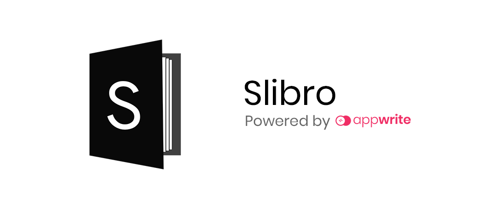
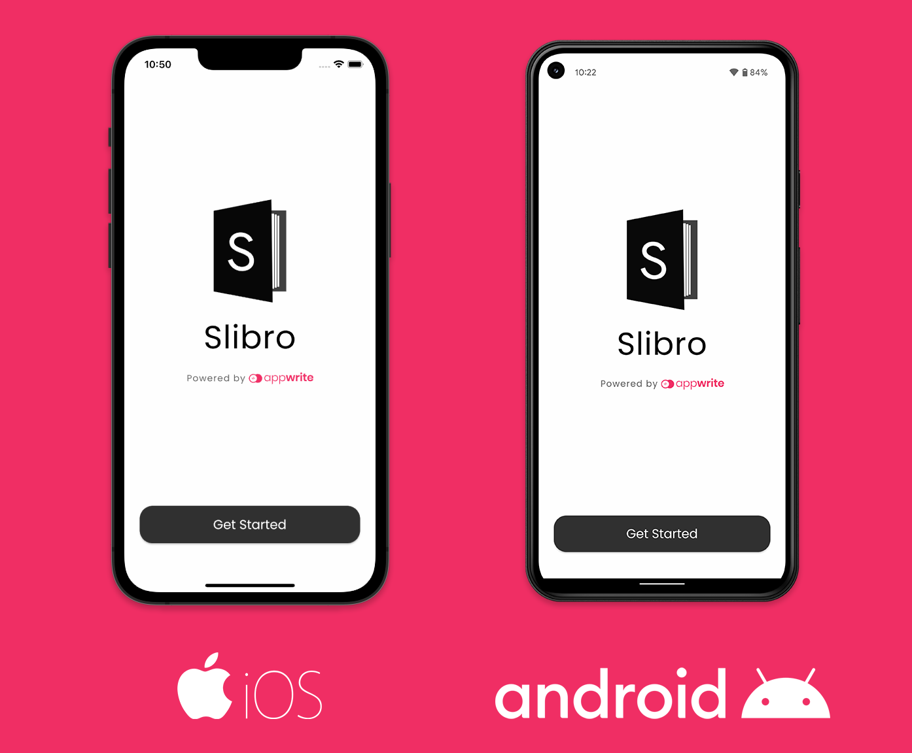
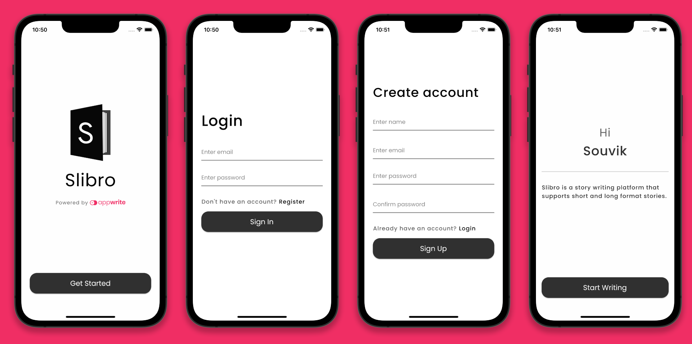
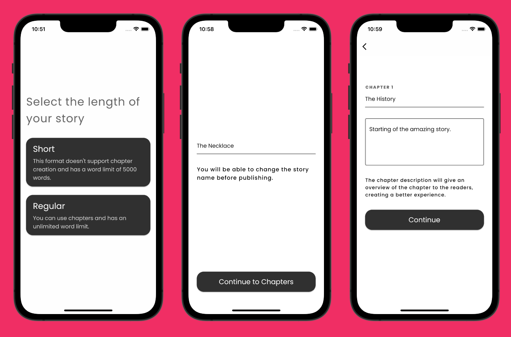
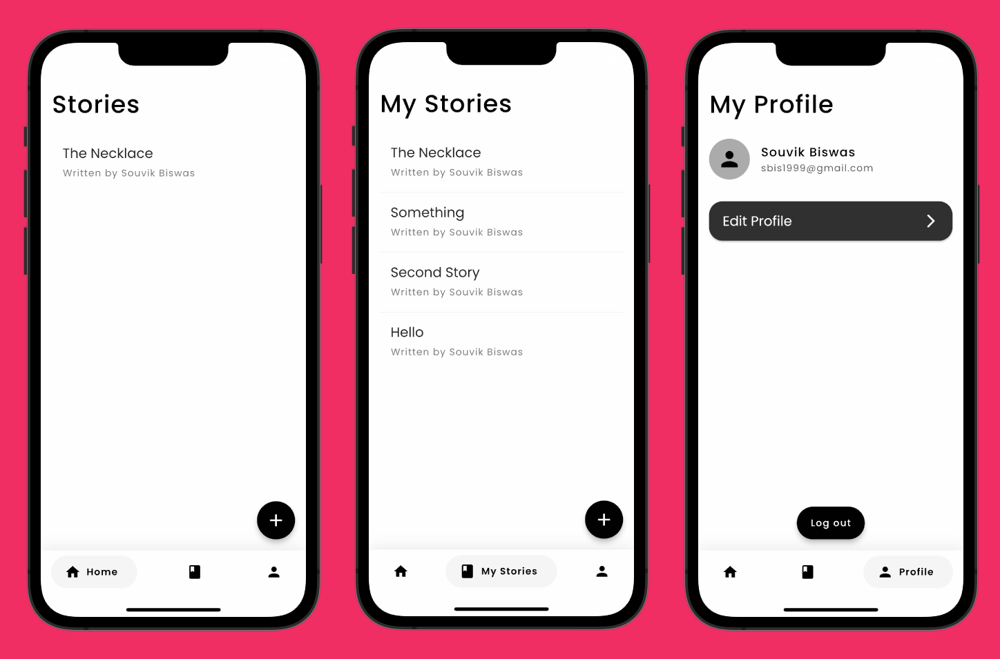

# Slibro [](https://codemagic.io/apps/6240c24a66f743ede7aca591/android-workflow/latest_build)



**Slibro** is a story writing platform that supports short and long format stories. [Flutter](https://flutter.dev/) and [Appwrite](https://appwrite.io/) is used to create this amazing cross-platform experience.

> Try out the app on Android from [here](https://appdistribution.firebase.dev/i/3fc14b5839069d3c).



## Usage

To run this from your system, you should have:

1. [Flutter SDK](https://docs.flutter.dev/get-started/install) installed and configured on your system.
2. Setup Appwrite using Docker.
3. Host the server locally using [ngrok](https://ngrok.com/).
4. Under `lib` directory, create a `secret.dart` file, and add the server URL to it.
5. Run using the following command:

   ```sh
   flutter run
   ```

## App Overview

The app now has full-fledged **story editor** (rich text - markdown), **story reader**, and **story management system** (to manage published/unpublished stories and explore other publisher's stories).

Some glimpses of Slibro's user interface are as follows:



The above four screens cover the authentication flow on the app using email/password method. These screens help a user to either create a new account or login using an existing account. Once a user signs up to the app, it navigates to the story creation flow.
 


These screens help a user to create the first story as a draft in the Slibro app. The user can also publish the story if wanted.


The editor and the reader screens are the most important ones, the editor also has rich text support using Markdown.



The three screens (Home, My Stories, and My Profile) shown above are part of the dashboard of the app, user can navigate to any of these using the Navigation bar accessible from these pages.

Navigation bar has a subtle animation to improve the UX of the app:


## Appwrite APIs

Three of the major Appwrite APIs are used:

* [Account API](https://appwrite.io/docs/client/account?sdk=flutter-default): Used for implementing user authentication and user data management.
* [Database API](https://appwrite.io/docs/client/database?sdk=flutter-default): Used for storing app data related to stories and chapters.
* [Storage API](https://appwrite.io/docs/client/storage?sdk=flutter-default): Used for storing the Rich Text story file in JSON format.

## Flutter packages

The following Flutter packages are used to build this app:

* [appwrite](https://pub.dev/packages/appwrite)
* [flutter_quill](https://pub.dev/packages/flutter_quill)
* [path_provider](https://pub.dev/packages/path_provider)
* [shared_preferences](https://pub.dev/packages/shared_preferences)
* [google_nav_bar](https://pub.dev/packages/google_nav_bar)
* [tuple](https://pub.dev/packages/tuple)

## License

Copyright 2022 Souvik Biswas

Licensed under the Apache License, Version 2.0 (the "License");
you may not use this file except in compliance with the License.
You may obtain a copy of the License at

    http://www.apache.org/licenses/LICENSE-2.0

Unless required by applicable law or agreed to in writing, software
distributed under the License is distributed on an "AS IS" BASIS,
WITHOUT WARRANTIES OR CONDITIONS OF ANY KIND, either express or implied.
See the License for the specific language governing permissions and
limitations under the License.
